# VeriSource AI: Formal System Architecture

This document provides a comprehensive, formal blueprint of the VeriSource AI platform. It details the interaction between the semantic retrieval core, the deterministic governance engine, and the external synthesis layers.

## 1. High-Level System Topology

VeriSource AI is built on a highly decoupled, modular architecture designed for high-stakes institutional environments where non-repudiation and evidentiary precision are paramount.

```mermaid
graph TD
    subgraph Client Layer
        UI[React 18 SPA Vite]
        Dashboard[Trust Dashboard]
        XAI_View[Counterfactual XAI UI]
        UI --> Dashboard
        UI --> XAI_View
    end

    subgraph Security & API Gateway
        FastAPI[FastAPI Gateway]
        Auth[JWT + RBAC Middleware]
        FastAPI --> Auth
    end

    subgraph Semantic Core
        Embed[ONNX FastEmbed MiniLM-L6]
        VectorDB[(ChromaDB)]
        Embed --> VectorDB
    end

    subgraph Deterministic Governance Engine
        DecisionGate[Multi-Stage Decision Gate]
        Entropy[Shannon Entropy Filter]
        Consensus[Standard Deviation Consensus]
        DecisionGate --> Entropy
        DecisionGate --> Consensus
    end

    subgraph Synthesis & Persistence
        Groq[Groq Llama-3.1-8b API]
        PG[(PostgreSQL / Supabase)]
        AuditLog[Cryptographic Audit Trailing]
        PG --> AuditLog
    end

    UI -->|HTTPS / REST| FastAPI
    Auth --> Embed: User Query
    VectorDB --> DecisionGate: Retrieved Chunks
    Entropy --> Groq: [Pass] Bounded Synthesis
    Consensus --> Groq: [Pass] Bounded Synthesis
    DecisionGate -.->|Fail/Veto| XAI_View: Trigger Counterfactual
    Groq --> FastAPI: Grounded Response
    FastAPI --> AuditLog: Async Write
```

---

## 2. Component-Level Breakdown

### 2.1 Client Presentation Layer (Frontend)
- **Framework:** React 18 (Vite for HMR).
- **Aesthetic:** Military/Financial Terminal design utilizing `brand-navy` and `gold` accents, glassmorphic overlays, and monospace diagnostic typography.
- **Key Components:**
  - **Trust Dashboard:** Visualizes raw mathematical metadata (Retrieval Focus, Evidence Consensus) using human-readable progress bars.
  - **Counterfactual XAI (Explainable AI):** Translates deterministic refusals into actionable "Why Not" guides (e.g., listing missing methodologies or policy clauses).

### 2.2 API & Security Gateway (Backend)
- **Framework:** FastAPI (Python 3.12+).
- **Concurrency:** Uvicorn ASGI server with strict OS-level thread restrictions to prevent M-Series ARM64 Mutex collisions between PyTorch and ChromaDB's C++ bindings.
- **Authentication:** Stateless JWT (JSON Web Tokens) with strict Role-Based Access Control (RBAC) separating `Admin` ingestion capabilities from `Student` verification requests.

### 2.3 The Semantic Core (Retrieval)
- **Embedding Optimization:** Replaced standard PyTorch `sentence-transformers` with **ONNX Runtime (`fastembed`)**. This dropped memory overhead by 60% and eliminated thread-lock panics on Apple Silicon.
- **Vector Database:** ChromaDB 1.5.1 operating locally.
- **Data Isolation:** Enforces absolute single-document bounds. Collections are mapped 1:1 with Document UUIDs (`doc_{uuid}`). Cross-document context contamination is structurally impossible.

---

## 3. The Deterministic Governance Engine

Unlike standard RAG architectures that feed raw retrieval directly to an LLM, VeriSource operates a **Governance Middleware** that mathematically evaluates the safety of a response *before* risking generation.

```mermaid
sequenceDiagram
    participant User
    participant Gateway as FastAPI
    participant Vector as ChromaDB (ONNX)
    participant Gov as Governance Engine
    participant LLM as Groq Llama-3.1

    User->>Gateway: POST /query (Policy Mode)
    Gateway->>Vector: Embed & Retrieve (k=8)
    Vector-->>Gov: Chunks + Cosine Distances
    
    rect rgb(20, 40, 60)
        Note over Gov: Stage 1: Signal Threshold Check
        Gov->>Gov: If avg_signal < 0.05 -> Refuse
    end
    
    rect rgb(20, 40, 60)
        Note over Gov: Stage 2: Entropy Calculation
        Gov->>Gov: Compute Shannon Entropy of distances
        Gov->>Gov: Apply penalty if Entropy > 1.8
    end
    
    rect rgb(20, 40, 60)
        Note over Gov: Stage 3: Consensus (Stability) Check
        Gov->>Gov: Compute Standard Deviation
        Gov->>Gov: If Variance > 0.65 -> Refuse (Conflict)
    end

    alt Passes All Gates
        Gov->>LLM: Dispatch Evidence-Constrained Prompt
        LLM-->>Gateway: Synthesized Output
    else Fails Any Gate
        Gov-->>Gateway: Refusal + Diagnostic XAI Data
    end
    
    Gateway-->>User: Final JSON Response
```



### Contextual Personas
The Governance Engine shifts its mathematical bounds based on the active mode:
- **Policy Mode (Institutional Safety):** Requires high signal (>0.05) and zero evidence conflict. Prioritizes "Refusal-First" safety.
- **Research Mode (Academic Discovery):** Lowers threshold to >0.03 and tolerates minor variance/conflict to allow for nuanced exploration of methodologies and diverse academic conclusions.

---

## 4. Traceability & Non-Repudiation (Audit Layer)

In highly regulated environments, the system must prove *why* it made a decision retrospectively.

- **Storage:** Relational data is pushed to a remote PostgreSQL instance (Supabase) via SQLAlchemy.
- **Cryptographic Provenance:** Every query generates a unique `transaction_id` hashed via SHA-256.
- **Immutable State Logging:** The system records:
  - User UUID & Document UUID
  - Raw Query Text
  - The calculated `confidence_score` at the exact moment of execution
  - The final verdict (`APPROVED` / `REFUSED`)
  - Timestamps in precise UTC (ISO 8601)

## 5. Extensibility & Future Scaling

VeriSource AI is designed to scale horizontally:
1. **Database Migration:** The system's Vector logic is cleanly decoupled. ChromaDB can be hot-swapped for PostgreSQL `pgvector` to consolidate Audit Logs and Vector Embeddings into a single transactional cloud layer.
2. **Asynchronous Workers:** Current governance math occurs synchronously. Integration with Celery/Redis background task queues can offload heavy Shannon Entropy calculations for massive 500+ page datasets.
3. **LLM Agnostic:** The synthesis layer is abstracted via a Provider interface. Groq (Llama-3.1) can be instantly swapped for local models (Ollama/Mistral) for offline, air-gapped deployments.
