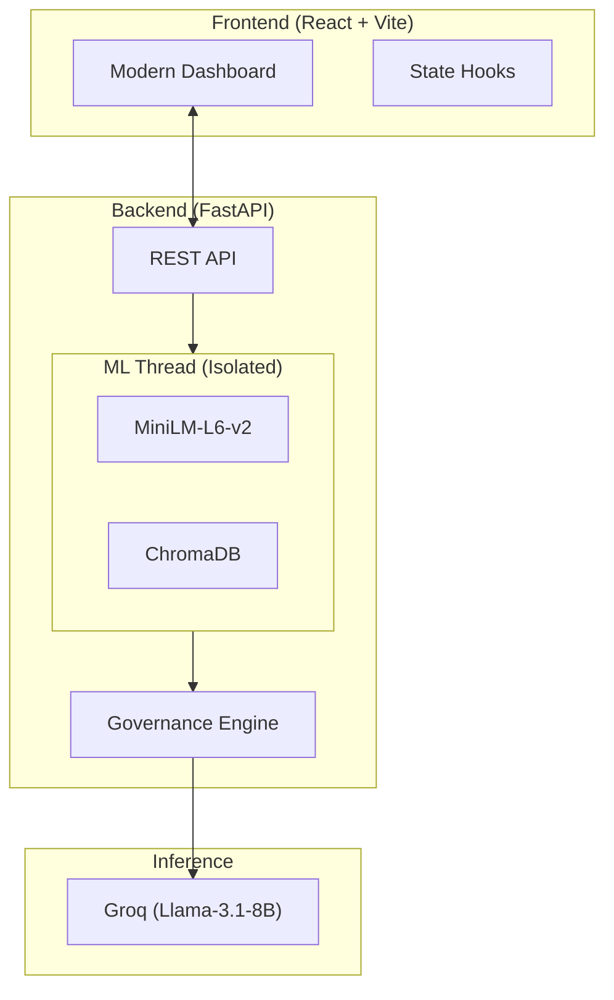

# VeriSource AI: Institutional-Grade Governance RAG

**VeriSource AI** is a high-fidelity Retrieval-Augmented Generation (RAG) platform designed for strict regulatory compliance, policy verification, and institutional document governance. 

Unlike standard "chat-with-pdf" tools, VeriSource implements a **Refusal-First Governance Engine**. It is engineered to prioritize accuracy and groundedness over fluid conversation, ensuring that every response is strictly backed by verifiable evidence.

---

## 🚀 Key Institutional Features

### 1. Governed Query Lifecycle (Evidence Gating)
The system uses a two-stage deterministic gate to prevent hallucinations:
*   **Stage 1 (Pre-LLM)**: Analyzes the statistical signal-to-noise ratio of retrieved chunks. If the evidence is weak, the system refuses to answer before even calling the LLM.
*   **Stage 2 (Post-LLM)**: Uses a **Sentinel Pattern** to detect model-level uncertainty. If the LLM signals a lack of evidence via hidden tokens, the system triggers a formal governance refusal.

### 2. Meta-RAG Quality Assurance
Every document uploaded undergoes an automated **Institutional Reliability Assessment**. 
*   The system generates autonomous verification probes based on document content.
*   It performs semantic coverage analysis to ensure the index is responsive to technical queries.
*   Provides a **Reliability Report** (High/Medium/Low Clarity) for administrators to identify document coverage gaps.

### 3. Institutional Audit Dashboard
*   **Verifiable Logs**: Every student interaction is logged with SHA-256 query hashing (privacy-preserving) and confidence metrics.
*   **Conflict Detection**: Identifies if retrieved document sections contradict each other.
*   **Confidence Calibration**: Technical vector scores are mapped to human-readable trust percentages.

---

## 🏗️ Technical Architecture

The platform uses a decoupled, asynchronous architecture optimized for stability on high-performance hardware (e.g., Apple Silicon).

### System Workflow

---

## 🛠️ Technology Stack

*   **Backend**: Python, FastAPI, SQLAlchemy (SQLite)
*   **Vector Engine**: ChromaDB (HNSWlib)
*   **Embeddings**: Sentence-Transformers (all-MiniLM-L6-v2) - *Optimized for technical text*
*   **LLM Inference**: Groq Cloud (Llama-3.1-8B-Instant)
*   **Frontend**: React, Tailwind CSS, Framer Motion, Lucide Icons
*   **Architecture**: Single-Threaded ML Executor (Zero Mutex Contention Pattern)

---

## ⚡ Setup & Installation

### Prerequisites
*   Python 3.10+
*   Node.js 18+
*   Groq API Key

### Backend Setup
1. `cd backend`
2. `python -m venv .venv && source .venv/bin/activate`
3. `pip install -r requirements.txt`
4. Create `.env` with `GROQ_API_KEY=your_key_here`
5. `./run.sh`

### Frontend Setup
1. `cd frontend`
2. `npm install`
3. `npm run dev`

---

## 🛡️ Governance Modes

*   **Policy Mode (Strict)**: Optimized for University Handbooks and Regulatory Docs. High threshold for approval (0.05 sim). Zero tolerance for conflict.
*   **Research Mode (Tolerant)**: Optimized for Academic Papers and Data Exploration. Lower threshold (0.03 sim) to allow for nuanced technical discovery.

---

## 📄 License
Institutional Private License. Designed and implemented for advanced AI Governance and Deployment.
